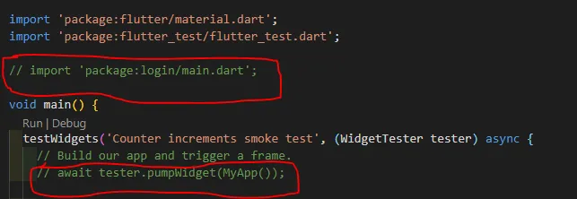
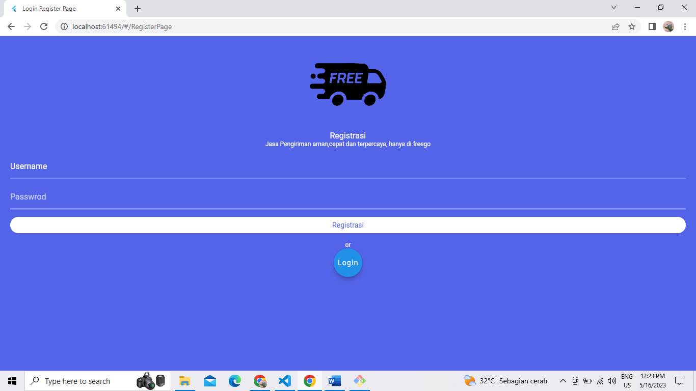
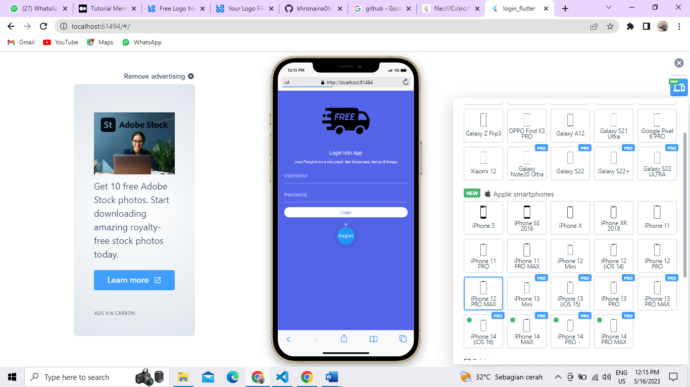
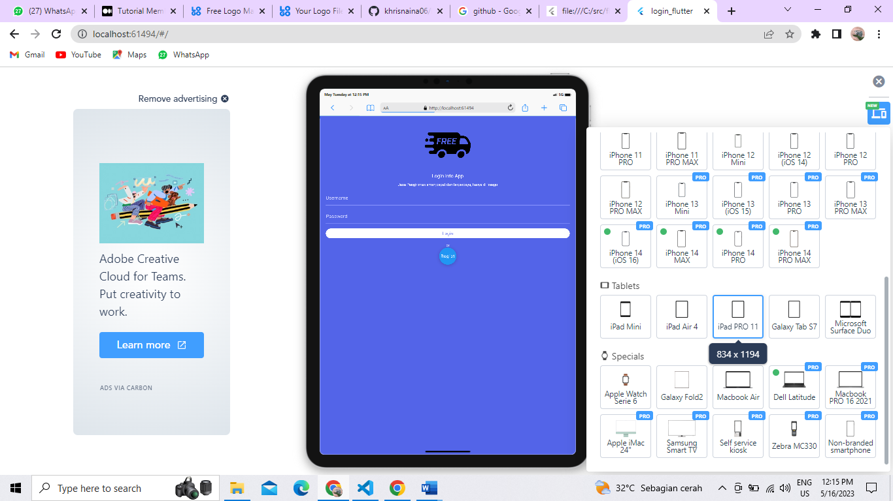

# login_flutter

1. Buat project flutter
Pertama laptop atau komputer kalian harus sudah terinstal flutter, dan gunakan IDE Android Studio atau Visual Studio Code. Buat project flutter dan beri nama misalkan login, tunggu hingga proses sinkronisasi selesai.

2. Menyiapkan assets

Sebelum menciptakan layout. kalian harus mempunyai asset gambar dahulu. Kemudian buat folder dengan nama assets, buat folder dalam assets dengan nama images, dan pindahkan assets gambar yang sudah kalian miliki ke folder images.

Selanjutnya pendaftaran gambar yang sudah ditambahkan dengan membuaka file pubspec.yaml, cari kata assets, hapus komentar dan tambahkan instruksi berikut:

assets:
- assets/images/
3. Menyiapkan assets warna

Untuk memudahkan penggunaan warna, buat file gres pada folder lib dan beri nama constants.dart. File ini nantinya dipakai untuk color palette yang akan dipanggil pada halaman login dan registrasi. Tulis kodenya seperti berikut:
```dart
import 'package:flutter/material.dart';
class ColorPalette{
static const primaryColor       = Color(0xff5364e8);
static const primaryDarkColor   = Color(0xff607Cbf);
static const underlineTextField = Color(0xff8b97ff);
static const hintColor          = Color(0xffccd1ff);
} 
```

4. Membuat Halaman Login

Selanjutnya buka folder lib, buat folder dengan nama screens dan buat file didalamnya denga nama login_view.dart. Folder screens dipakai untuk halaman supaya file didalam folder lib lebih rapi. Ketik instruksi code berikut didalam file login_view.dart:
```dart
import 'package:flutter/material.dart';
import 'package:login/constants.dart';
import 'package:login/screens/register_view.dart';
class LoginPage extends StatelessWidget {
@override
Widget build(BuildContext context) {
return Scaffold(
body: Container(
color: ColorPalette.primaryColor,
padding: EdgeInsets.all(20.0),
child: ListView(
children: <Widget>[
Center(
child: Column(
children: <Widget>[
_iconLogin(),
_titleDescription(),
_textField(),
_buildButton(context),
],
),
),
],
),
),
);
}
}
Widget _iconLogin() {
return Image.asset(
"assets/images/logo.png",
height: 150.0,
width: 150.0,
);
}
Widget _titleDescription() {
return Column(
children: <Widget>[
Padding(
padding: EdgeInsets.only(top: 16.0),
),
Text(
"Login Into App",
style: TextStyle(
color: Colors.white,
fontSize: 16.0,
),
),
Padding(
padding: EdgeInsets.only(top: 12.0),
),
Text(
"Lorem Ipsum sim amet , lorem ipsum amet",
style: TextStyle(
fontSize: 12.0,
color: Colors.white,
),
textAlign: TextAlign.center,
),
],
);
}
Widget _textField() {
return Column(
children: <Widget>[
Padding(
padding: EdgeInsets.only(top: 12.0),
),
TextFormField(
decoration: const InputDecoration(
border: UnderlineInputBorder(),
enabledBorder: UnderlineInputBorder(
borderSide: BorderSide(
color: ColorPalette.underlineTextField,
width: 1.5,
),
),
focusedBorder: UnderlineInputBorder(
borderSide: BorderSide(
color: Colors.white,
width: 3.0,
),
),
hintText: "Username",
hintStyle: TextStyle(color: ColorPalette.hintColor),
),
style: TextStyle(color: Colors.white),
autofocus: false,
),
Padding(
padding: EdgeInsets.only(top: 12.0),
),
TextFormField(
decoration: const InputDecoration(
border: UnderlineInputBorder(),
enabledBorder: UnderlineInputBorder(
borderSide: BorderSide(
color: ColorPalette.underlineTextField,
width: 1.5,
),
),
focusedBorder: UnderlineInputBorder(
borderSide: BorderSide(
color: Colors.white,
width: 3.0,
),
),
hintText: "Password",
hintStyle: TextStyle(color: ColorPalette.hintColor),
),
style: TextStyle(color: Colors.white),
obscureText: true,
autofocus: false,
),
],
);
}
Widget _buildButton(BuildContext) {
return Column(
children: <Widget>[
Padding(
padding: EdgeInsets.only(top: 16.0),
),
InkWell(
child: Container(
padding: EdgeInsets.symmetric(vertical: 8.0),
width: double.infinity,
child: Text(
'Login',
style: TextStyle(color: ColorPalette.primaryColor),
textAlign: TextAlign.center,
),
decoration: BoxDecoration(
color: Colors.white,
borderRadius: BorderRadius.circular(30.0),
),
),
),
Padding(
padding: EdgeInsets.only(top: 16.0),
),
Text(
'or',
style: TextStyle(
color: Colors.white,
fontSize: 12.0,
),
),
FlatButton(
child: Text(
'Register',
style: TextStyle(color: Colors.white),
),
onPressed: () {
Navigator.pushNamed(BuildContext, RegisterPage.routeName);
},
),
],
);
}
```
Catatan:

pada import dan pemanggilan class halaman register masih error sebab kita belum membuatnya, biarkan terlebih dahulu dan ikuti langkagh berikutnya

5. Membuat Halaman Register

Buat file pada folder lib > screens dengan nama register_view.dart, dan tambahkan kodenya seperti berikut:
```dart
import 'package:flutter/material.dart';
import 'package:login/constants.dart';
class RegisterPage extends StatefulWidget {
static const routeName = "/RegisterPage";
@override
_RegisterPageState createState() => _RegisterPageState();
}
class _RegisterPageState extends State<RegisterPage> {
@override
Widget build(BuildContext context) {
return Scaffold(
body: Container(
color: ColorPalette.primaryColor,
padding: EdgeInsets.all(20.0),
child: ListView(
children: <Widget>[
_iconRegistrasi(),
_titleDescription(),
_textField(),
_buildButton(context),
],
),
),
);
}
}
Widget _iconRegistrasi() {
return Image.asset(
"assets/images/logo.png",
width: 150.0,
height: 150.0,
);
}
Widget _titleDescription() {
return Column(
children: <Widget>[
Padding(
padding: EdgeInsets.only(top: 16.0),
),
Text(
"Registrasi",
style: TextStyle(
color: Colors.white,
fontSize: 16.0,
),
),
Text(
"Lorem Impsum dolar sit amrt lorem ipsum ",
style: TextStyle(
color: Colors.white,
fontSize: 12.0,
),
textAlign: TextAlign.center,
),
],
);
}
Widget _textField() {
return Column(
children: <Widget>[
Padding(
padding: EdgeInsets.only(top: 12.0),
),
TextFormField(
decoration: const InputDecoration(
border: UnderlineInputBorder(),
enabledBorder: UnderlineInputBorder(
borderSide: BorderSide(
color: ColorPalette.underlineTextField,
width: 1.5,
),
),
focusedBorder: UnderlineInputBorder(
borderSide: BorderSide(
color: Colors.white,
width: 3.0,
),
),
hintText: "Username",
hintStyle: TextStyle(color: Colors.white),
),
style: TextStyle(color: Colors.white),
autofocus: false,
),
Padding(
padding: EdgeInsets.only(top: 12.0),
),
TextFormField(
decoration: const InputDecoration(
border: UnderlineInputBorder(),
enabledBorder: UnderlineInputBorder(
borderSide: BorderSide(
color: ColorPalette.underlineTextField,
width: 3.0,
),
),
focusedBorder: UnderlineInputBorder(
borderSide: BorderSide(
color: Colors.white,
width: 3.0,
),
),
hintText: "Passwrod",
hintStyle: TextStyle(color: ColorPalette.hintColor),
),
style: TextStyle(color: Colors.white),
obscureText: true,
autofocus: false,
),
],
);
}
Widget _buildButton(BuildContext context) {
return Column(
children: <Widget>[
Padding(
padding: EdgeInsets.only(top: 16.0),
),
InkWell(
child: Container(
padding: EdgeInsets.symmetric(vertical: 8.0),
width: double.infinity,
child: Text(
'Registrasi',
style: TextStyle(color: ColorPalette.primaryColor),
textAlign: TextAlign.center,
),
decoration: BoxDecoration(
color: Colors.white,
borderRadius: BorderRadius.circular(30.0),
),
),
),
Padding(
padding: EdgeInsets.only(top: 16.0),
),
Text(
'or',
style: TextStyle(
color: Colors.white,
fontSize: 12.0,
),
),
FlatButton(
child: Text(
'Login',
style: TextStyle(color: Colors.white),
),
onPressed: () {
Navigator.pushNamed(context, "/");
},
)
],
);
}
```
6. Membuat Routing

Routing dipakai untuk berpindah halaman, kita akan menghubungkan halaman login dan register. Buka file main.dart pada folder lib, dan ubah kodenya menjadi kode berikut ini:

```dart
import 'package:flutter/material.dart';
import 'package:login/screens/login_view.dart';
import 'package:login/screens/register_view.dart';
void main(){
runApp(MaterialApp(
debugShowCheckedModeBanner: false,
title: "Login Register Page",
initialRoute: "/",
routes: {
"/" : (context) => LoginPage(),
RegisterPage.routeName : (context) => RegisterPage(),
},
));
}
```
Catatan:

initialRoute dipakai untuk raoute yang pertama kali ditampilkan pada aplikasi, intruksi diatas halaman yang pertama ditampilkan adalah login.

7. Finishing

Sebelum projectnya dijalankan, buka file widget_test.dart pada folder test. Tambahkan komentar // untuk impirt main dan MyApp. seperti dibawah ini:
- **Gambar**



Results Run code :



